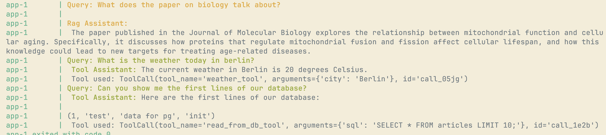

**Description**

Make an autonomous assistant that can respond to user's queries of a collection of BBC News articles based on the type/category of the query.

features:
  - automatic and intelligent query routing, based on 4 types of categories: 
    - RAG on the articles
    - access to the DB of the articles to answer questions like: how many articles talk about subject `A`
    - access to various tools for api calls and whatnot
    - general questions based on training date
  - TBD  

example:
- user: What does the article about Trump tarrifs talk about exactly? does it feature the % of tarrifs on china?
- system: llm routes query to -> `rag_query` -> queries rag pipeline -> returns answer
- user: ok, can you compare it to tarrifs of 2019? 
- system: llm routes query to -> `tool_use` -> websearch: query = trump china tarrifs 2019

Execution example

