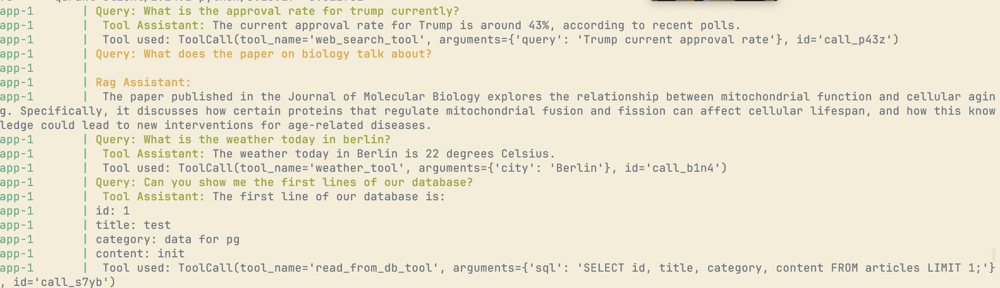

**Description**

Make an autonomous assistant that can respond to user's queries of a collection of BBC News articles based on the type/category of the query.

features:
  - automatic and intelligent query routing, based on 4 types of categories: 
    - RAG on the articles
    - access to the DB of the articles to answer questions like: how many articles talk about subject `A`
    - access to various tools for api calls and whatnot
    - general questions based on training date
  - TBD  

example:
- user: What does the article about Trump tarrifs talk about exactly? does it feature the % of tarrifs on china?
- system: llm routes query to -> `rag_query` -> queries rag pipeline -> returns answer
- user: ok, can you compare it to tarrifs of 2019? 
- system: llm routes query to -> `tool_use` -> websearch: query = trump china tarrifs 2019

Execution example

-----------------------------------------

# Todo: 
### Assistant: 
  - [X] Refactor some bad code
  - [X] Get Basic rag with routing 
    - [X] Custom routing component 
  - [X] Connect routed query to relevant actor
    - [X] Connect routed query to rag_q 
    - [X] Setup agent that accepts tools: 
      - [X] Write few tools
      - [X] Connect routed query to tool 
      - [X] Connect routed query to db_tool 
      - [X] Connect routed query to general qa 
      - [X] Connect routed query to tool: web_search 

### Index:
  - [ ] Index all data with correct metadata, and different steps
      - [X] Store csv into RDB
      - [X] Store all cells with metadata
      - [ ] experiment with different strats (different chunks etc..)

  - [ ] Retrieval
      - [ ] baseline + mrr
          - [ ] test data + examples
          - [ ] calc mrr
          - [ ] document findings
      - [ ] HyDe 
      - [ ] evaluate
      - [ ] automatic metadata labeling + filtering(?)

### Setup infra and db
  - [X] DB 
  - [X] Docker/Docker comp

### Tests !!! : 

  - [ ] Assistant 
  - [X] DB
  - [X] ETL 
  - [ ] Indexing  
      - [X] CSVComponent
      - ...

